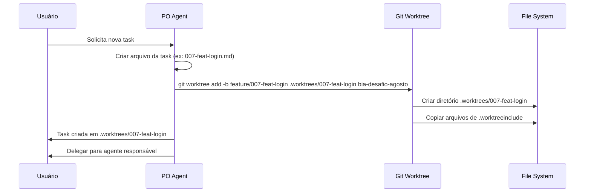
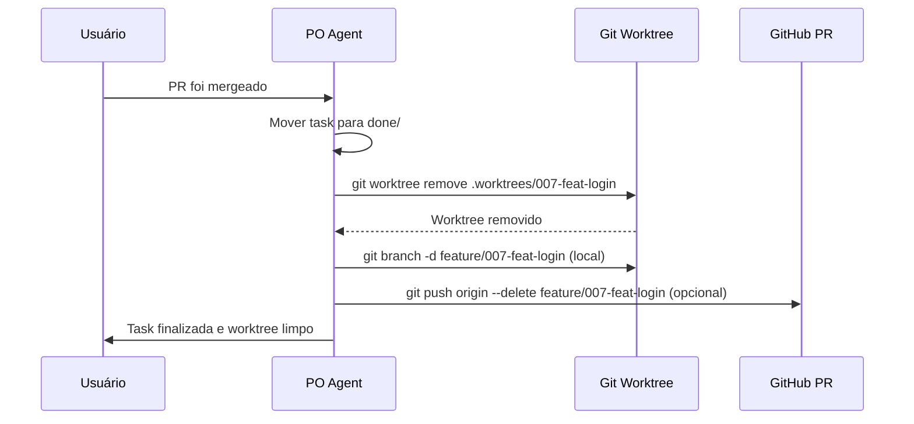

# [006] Sistema de Worktrees para Gerenciamento de Tasks

## Tipo
`feat`

## Agente Responsável
`po` (.kiro/agents/po.json)

## Branch
- **Base:** `bia-desafio-agosto`
- **Branch da task:** `feature/006-feat-sistema-worktrees`

---

## Modelo de Trabalho

- Cada task possui seu próprio branch E seu próprio worktree isolado
- O agente responsável deve seguir os passos abaixo antes de iniciar a implementação

---

## Instruções de Início

Ao iniciar esta task, o agente deve:

1. Verificar se está no branch `bia-desafio-agosto`. Caso não esteja, informar e perguntar se pode retornar a ele antes de prosseguir.
2. Após autorizado: mover este arquivo para `.kiro/tasks/doing/`, fazer commit e push no branch `bia-desafio-agosto`.
3. Criar o worktree e branch `feature/006-feat-sistema-worktrees` a partir de `bia-desafio-agosto` e iniciar a implementação.

---

## Descrição

Implementar um sistema de gerenciamento de worktrees para o projeto BIA, similar ao Claude Code e Codex, que:

1. **Cria automaticamente um worktree isolado** quando uma nova task é criada
2. **Organiza worktrees em diretório específico** (`.worktrees/`) ignorado pelo git
3. **Remove worktrees automaticamente** após o merge do Pull Request
4. **Mantém o worktree principal limpo** para revisões e operações do PO
5. **Permite trabalho paralelo** em múltiplas tasks sem conflitos de arquivos

## Contexto

Atualmente, o projeto trabalha com feature branches, mas todos os agentes trabalham no mesmo diretório. Isso pode causar:
- Conflitos ao trocar de branch com mudanças não commitadas
- Necessidade de stash/unstash constante
- Risco de commitar na branch errada
- Impossibilidade de trabalhar em múltiplas tasks simultaneamente

Com worktrees, cada task terá seu próprio diretório isolado, permitindo que múltiplos agentes trabalhem em paralelo sem interferências.

**Inspiração:** [Claude Code Worktrees](https://claude-code.mintlify.app/en/worktrees) - sistema que cria worktrees em `.claude/worktrees/` e mantém o diretório no `.gitignore`.

---

## Arquitetura Proposta

### Estrutura de Diretórios

```
/bia (worktree principal)
├── .git/                    # Repositório git principal
├── .worktrees/              # Diretório de worktrees (gitignored)
│   ├── 007-feat-login/      # Worktree da task 007
│   ├── 008-fix-bug-api/     # Worktree da task 008
│   └── 009-feat-dashboard/  # Worktree da task 009
├── .gitignore               # Incluir .worktrees/
├── .worktreeinclude         # Arquivos para copiar em novos worktrees
└── .kiro/
    ├── tasks/
    │   ├── doing/
    │   ├── done/
    │   └── sequencial.md
    └── po/
        └── worktree-manager.md  # Este documento
```

### Fluxo de Criação de Task com Worktree



### Fluxo de Finalização de Task



---

## Critérios de Aceite

### 1. Configuração Inicial
- [ ] Adicionar `.worktrees/` ao `.gitignore`
- [ ] Criar arquivo `.worktreeinclude` com arquivos essenciais a copiar
- [ ] Criar documentação em `.kiro/po/worktree-manager.md`

### 2. Criação de Worktree ao Criar Task
- [ ] PO deve criar worktree automaticamente ao criar nova task
- [ ] Worktree deve ser criado em `.worktrees/[numero]-[tipo]-[resumo]/`
- [ ] Branch deve ser criada a partir de `bia-desafio-agosto`
- [ ] Arquivos de `.worktreeinclude` devem ser copiados automaticamente

### 3. Gerenciamento de Worktree
- [ ] Listar worktrees existentes com `git worktree list`
- [ ] Validar se worktree já existe antes de criar
- [ ] Documentar comandos para navegar entre worktrees

### 4. Remoção de Worktree após Merge
- [ ] PO deve remover worktree após confirmação de merge
- [ ] Validar que não há mudanças não commitadas antes de remover
- [ ] Deletar branch local após remoção do worktree
- [ ] Opcionalmente deletar branch remota (se não foi deletada automaticamente pelo GitHub)

### 5. Documentação
- [ ] Documentar fluxo completo de criação de task com worktree
- [ ] Documentar comandos de troubleshooting
- [ ] Adicionar exemplos práticos
- [ ] Atualizar especificação do PO com novo fluxo

---

## Arquivos a Criar/Modificar

| Ação | Arquivo | Descrição |
|------|---------|-----------|
| Modificar | `.gitignore` | Adicionar `.worktrees/` |
| Criar | `.worktreeinclude` | Listar arquivos para copiar em novos worktrees |
| Criar | `.kiro/po/worktree-manager.md` | Documentação completa do sistema |
| Modificar | `.kiro/po/especificacao.md` | Atualizar com novo fluxo de worktrees |

---

## Conteúdo do `.worktreeinclude`

Baseado nas necessidades do projeto BIA, devemos copiar:

```gitignore
# Variáveis de ambiente (se existirem e forem gitignored)
.env
.env.local
.env.development
.env.test

# Configurações locais da IDE (se necessário)
.vscode/settings.json

# Node modules (NÃO copiar, apenas referenciar - symlink se necessário)
# node_modules são reinstalados em cada worktree
```

**Nota:** Como node_modules é grande, cada worktree deve instalar suas próprias dependências. Alternativamente, pode-se usar symlink para economizar espaço.

---

## Comandos Essenciais

### Criar Worktree para Nova Task

```bash
# Sintaxe
git worktree add -b <branch-name> .worktrees/<task-folder> bia-desafio-agosto

# Exemplo prático
git worktree add -b feature/007-feat-implementar-login .worktrees/007-feat-login bia-desafio-agosto
```

### Listar Worktrees

```bash
git worktree list
```

**Saída esperada:**
```
/Users/aluno/projetos/bia                      a1b2c3d [bia-desafio-agosto]
/Users/aluno/projetos/bia/.worktrees/007-feat-login  e4f5g6h [feature/007-feat-login]
```

### Navegar Entre Worktrees

```bash
# Entrar no worktree da task
cd .worktrees/007-feat-login

# Verificar branch atual
git branch --show-current

# Voltar ao worktree principal
cd ../..
```

### Remover Worktree (Após Merge)

```bash
# Remover worktree
git worktree remove .worktrees/007-feat-login

# Se houver mudanças não commitadas, forçar remoção (use com cuidado!)
git worktree remove --force .worktrees/007-feat-login

# Deletar branch local
git branch -d feature/007-feat-login

# Deletar branch remota (se necessário)
git push origin --delete feature/007-feat-login
```

### Limpar Worktrees Órfãos

```bash
# Se worktree foi deletado manualmente
git worktree prune
```

---

## Fluxo Completo: Da Criação ao Merge

### 1. PO Cria Nova Task

```bash
# 1.1. Estar no worktree principal e branch base
cd ~/projetos/bia
git checkout bia-desafio-agosto
git pull origin bia-desafio-agosto

# 1.2. Criar arquivo da task
# (processo atual - criar 007-feat-implementar-login.md)

# 1.3. Criar worktree para a task
git worktree add -b feature/007-feat-implementar-login .worktrees/007-feat-login bia-desafio-agosto

# 1.4. Copiar arquivos necessários (se não usou .worktreeinclude)
# cp .env .worktrees/007-feat-login/ (se necessário)

# 1.5. Verificar criação
git worktree list

# 1.6. Mover task para doing/ e commitar no branch base
mv .kiro/tasks/007-feat-implementar-login.md .kiro/tasks/doing/
git add .kiro/tasks/doing/007-feat-implementar-login.md
git commit -m "chore: mover task 007 para doing"
git push origin bia-desafio-agosto

# 1.7. Delegar ao agente responsável
# Informar: "Task criada em .worktrees/007-feat-login - entre nesse diretório para trabalhar"
```

### 2. Agente Trabalha no Worktree

```bash
# 2.1. Entrar no worktree
cd .worktrees/007-feat-login

# 2.2. Confirmar branch
git branch --show-current
# Output: feature/007-feat-implementar-login

# 2.3. Instalar dependências (se necessário)
npm install

# 2.4. Implementar a feature
# ... código ...

# 2.5. Commitar mudanças
git add .
git commit -m "feat: implementar tela de login"

# 2.6. Push do branch
git push origin feature/007-feat-implementar-login

# 2.7. Criar Pull Request
gh pr create --base bia-desafio-agosto --head feature/007-feat-implementar-login

# 2.8. Informar ao PO que task está pronta
```

### 3. PO Valida e Faz Merge

```bash
# 3.1. PO pode revisar no worktree principal (se quiser)
cd ~/projetos/bia
gh pr view 3 --web

# 3.2. Após validação, fazer merge do PR
gh pr merge 3 --squash --delete-branch

# 3.3. Atualizar branch base local
git checkout bia-desafio-agosto
git pull origin bia-desafio-agosto
```

### 4. PO Remove Worktree

```bash
# 4.1. Remover worktree
git worktree remove .worktrees/007-feat-login

# 4.2. Verificar remoção
git worktree list

# 4.3. Deletar branch local (se ainda existir)
git branch -d feature/007-feat-implementar-login

# 4.4. Mover task para done/
mv .kiro/tasks/doing/007-feat-implementar-login.md .kiro/tasks/done/

# 4.5. Commitar finalização
git add .kiro/tasks/done/007-feat-implementar-login.md
git add .kiro/tasks/doing/007-feat-implementar-login.md  # Remove do doing
git commit -m "chore: finalizar task 007"
git push origin bia-desafio-agosto
```

---

## Benefícios do Sistema de Worktrees

### ✅ Isolamento Completo
- Cada task em seu próprio diretório
- Sem risco de conflitos entre tasks paralelas
- Mudanças isoladas por contexto

### ✅ Produtividade
- Não precisa fazer stash/unstash
- Troca instantânea entre tasks (só muda de diretório)
- Múltiplos agentes podem trabalhar simultaneamente

### ✅ Segurança
- Worktree principal sempre limpo para o PO
- Menos risco de commitar na branch errada
- Fácil rollback (só deletar o worktree)

### ✅ Organização
- Estrutura clara com `.worktrees/`
- Fácil identificar tasks em andamento
- Gitignore mantém repositório limpo

---

## Troubleshooting

### Erro: "fatal: '<branch>' is already checked out"

**Causa:** Branch já está em uso em outro worktree.

**Solução:**
```bash
# Listar worktrees
git worktree list

# Remover worktree antigo
git worktree remove .worktrees/007-feat-login
```

---

### Erro: "fatal: '<path>' already exists"

**Causa:** Diretório já existe.

**Solução:**
```bash
# Opção 1: Usar outro nome
git worktree add -b feature/007-v2 .worktrees/007-feat-login-v2 bia-desafio-agosto

# Opção 2: Remover diretório existente (cuidado!)
rm -rf .worktrees/007-feat-login
git worktree add -b feature/007-feat-login .worktrees/007-feat-login bia-desafio-agosto
```

---

### Worktree deletado manualmente

**Solução:**
```bash
# Limpar referências
git worktree prune

# Verificar limpeza
git worktree list
```

---

### Não consigo remover worktree com mudanças

**Solução:**
```bash
# Opção 1: Commitar mudanças antes de remover
cd .worktrees/007-feat-login
git add .
git commit -m "wip: salvar progresso"
cd ../..
git worktree remove .worktrees/007-feat-login

# Opção 2: Forçar remoção (perde as mudanças!)
git worktree remove --force .worktrees/007-feat-login
```

---

## Checklist do Agente `po`

> Marque cada item à medida que for concluído durante a implementação.

- [ ] Verificar branch atual — confirmar que está em `bia-desafio-agosto`
- [ ] Mover este arquivo para `.kiro/tasks/doing/`
- [ ] Fazer commit e push no branch `bia-desafio-agosto`
- [ ] Criar o worktree `.worktrees/006-feat-sistema-worktrees`
- [ ] Criar branch `feature/006-feat-sistema-worktrees` a partir de `bia-desafio-agosto`
- [ ] Entrar no worktree criado
- [ ] Modificar `.gitignore` para incluir `.worktrees/`
- [ ] Criar arquivo `.worktreeinclude` com arquivos essenciais
- [ ] Criar documentação em `.kiro/po/worktree-manager.md`
- [ ] Atualizar `.kiro/po/especificacao.md` com novo fluxo
- [ ] Testar criação de worktree manualmente
- [ ] Testar remoção de worktree
- [ ] Testar fluxo completo (criar task → trabalhar → merge → remover)
- [ ] Documentar comandos de troubleshooting
- [ ] Fazer commit das alterações
- [ ] Push do branch `feature/006-feat-sistema-worktrees`
- [ ] Criar Pull Request
- [ ] Validar que o workflow de testes passou
- [ ] Informar ao usuário que a task está pronta para review

---

## Encerramento — Responsabilidade do `po`

Quando o agente `po` concluir e sinalizar a finalização, o `po` deve:

- [ ] Verificar se todos os critérios de aceite foram atendidos
- [ ] Confirmar que todos os itens do checklist do agente estão marcados
- [ ] Validar que arquivos foram criados corretamente
- [ ] Testar fluxo completo de worktree
- [ ] Informar ao usuário que a task está finalizada
- [ ] Aguardar confirmação de merge do PR
- [ ] Após merge: remover worktree `.worktrees/006-feat-sistema-worktrees`
- [ ] Mover este arquivo para `.kiro/tasks/done/`
- [ ] Fazer commit e push final (branch `bia-desafio-agosto`)
- [ ] Deletar branch local `feature/006-feat-sistema-worktrees`

---

## Próximos Passos

Após implementação desta task, todas as tasks futuras seguirão o novo fluxo:

1. **Criar task** → PO cria worktree automaticamente
2. **Trabalhar** → Agente trabalha dentro do worktree isolado
3. **Merge** → PR é mergeado normalmente
4. **Limpar** → PO remove worktree após confirmação de merge

Este sistema permitirá trabalho paralelo em múltiplas features sem conflitos!
